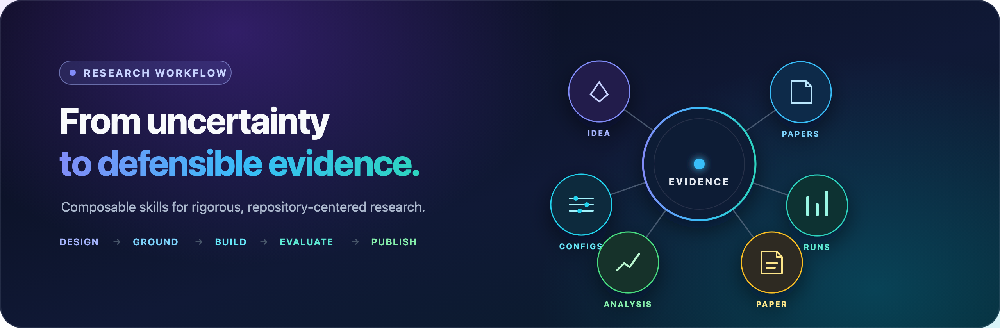
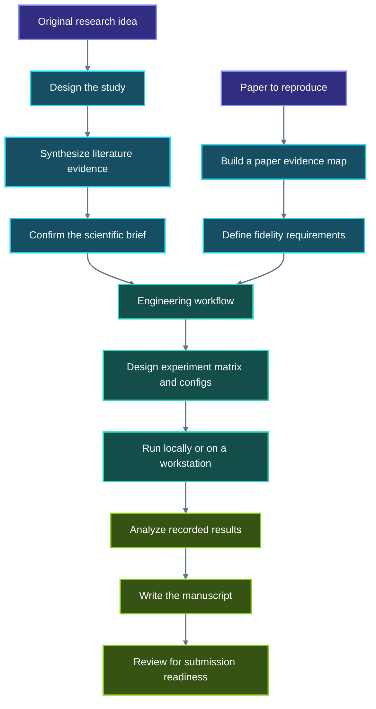

<div align="center">
  <h1>research-agents</h1>
  <p><strong>Evidence-first research workflows for modern coding agents</strong></p>
  <p>
    Turn an early idea or research paper into a reproducible implementation,<br />
    defensible experiments, validated analysis, and an evidence-grounded manuscript.
  </p>
  <p>
    
    
    
    
  </p>
  <p>
    <a href="#quick-start">Quick start</a> ·
    <a href="#research-workflow">Workflow</a> ·
    <a href="docs/skill-reference.md">Skill reference</a> ·
    <a href="docs/paper-writing.md">Paper writing</a> ·
    <a href="docs/compatibility.md">Compatibility</a>
  </p>
</div>

<p align="center">
  
</p>

---

`research-agents` is a portable, skills-first toolkit for repository-centered
research with Codex, Claude Code, OpenCode, and compatible coding agents. Its
composable workflows cover study design, local-paper synthesis, faithful
reimplementation, experiment configuration, reproducible analysis, manuscript
writing, review, and documentation maintenance.

> [!IMPORTANT]
> This project provides deterministic skills and native adapters—not autonomous
> researchers. Scientific claims remain evidence-bound, consequential decisions
> remain visible to the user, and native compatibility remains unverified until
> a clean-session smoke test is recorded.

## Why research-agents?

| `01` &nbsp; Evidence first | `02` &nbsp; Reproducible by design | `03` &nbsp; Portable and composable |
| --- | --- | --- |
| Claims trace back to papers, code, configs, or recorded results. Missing evidence stays visible. | Templates, seeds, run provenance, notebooks, and artifacts are preserved for review. | The same 16 skills work as bounded stages and hand off cleanly to engineering workflows. |

### What it covers

| Stage | Built-in capability |
| --- | --- |
| **Frame** | Research questions, falsifiable hypotheses, claim-to-evidence contracts, feasibility checks, and threats to validity |
| **Ground** | Scoped synthesis of user-provided local PDFs and evidence-aware reading of individual papers |
| **Build** | Safe repository initialization and scientific fidelity briefs for downstream engineering |
| **Evaluate** | Confirmed `core` and `supplementary` experiment matrices plus repository-native configurations |
| **Analyze** | Rerunnable notebooks built from metrics, logs, baselines, ablations, and repeated runs |
| **Communicate** | Evidence-grounded LaTeX section writers, independent paper review, and documentation audits |

## Quick start

### 1. Install for your coding agent

| Coding agent | Installation guide | Integration |
| --- | --- | --- |
| **Codex** | [Install for Codex](docs/install/codex.md) | Native skill discovery |
| **Claude Code** | [Install for Claude Code](docs/install/claude-code.md) | Plugin with a session-start bootstrap |
| **OpenCode** | [Install for OpenCode](docs/install/opencode.md) | Runtime plugin registration |

### 2. Start a clean session

Confirm that the package is discoverable:

```text
List the installed research skills.
```

### 3. Ask for the outcome you need

Start with a natural-language request such as:

```text
Turn this idea into a testable study design.
```

```text
Initialize a research project.
```

```text
Prepare a research implementation brief for reproducing this paper.
```

> [!TIP]
> Skill IDs are optional. Describe the desired outcome and provide the relevant
> files or folders; the bootstrap selects the matching research workflow.

The initializer gathers project details one question at a time, presents the
complete scaffold, and waits for explicit confirmation before writing. Existing
files are preserved unless you approve conflict handling. IEEE template
downloads require network access and are recorded with source URL, retrieval
time, and SHA-256 provenance in `paper/TEMPLATE.md`.

For detailed usage, read the [research workflow guide](docs/research-workflow.md)
and the complete [skill reference](docs/skill-reference.md).

## Research workflow

Two entry paths converge on the same implementation, experiment, analysis, and
writing workflow.



### Original study

1. `research-designing-study` turns an early idea into a confirmed study brief
   with research questions, hypotheses, a claim-to-evidence contract,
   feasibility constraints, threats to validity, and scientific acceptance
   criteria.
2. `literature-synthesizing-evidence` synthesizes user-provided local PDFs into
   a source inventory, cross-paper evidence matrix, thematic findings, and a
   bounded assessment of the provisional research gap.
3. Revise and confirm the study design against the literature evidence.
4. `research-initializing-project` scaffolds the reproducible repository from
   the confirmed brief.

### Faithful paper reproduction

1. `paper-reading` builds an evidence map from the paper and its supplementary
   material.
2. `paper-planning-reimplementation` converts that evidence into a scientific
   implementation brief with fidelity requirements, assumptions, gaps,
   deviations, and acceptance criteria.

### Shared downstream workflow

1. Superpowers, when installed, consumes the confirmed brief for engineering
   design, task decomposition, implementation, testing, and review. Another
   engineering workflow can consume the same brief when Superpowers is absent.
2. `experiments-designing-configurations` inspects repository evidence and asks
   only unresolved questions that affect validity or runnability. It presents a
   complete `core` and `supplementary` matrix before writing configs.
3. Run the confirmed commands locally or on an external workstation. Preserve
   the source revision, environment, config, run ID, seed, and output provenance.
4. `results-analyzing-experiments` reconciles recorded metrics, runs, baselines,
   and ablations, then creates or revises a rerunnable notebook under
   `results/analysis/` when the task needs an artifact. Requested exports go to
   `results/figures/` and `results/tables/`.

Example requests:

```text
Turn this idea into a testable study design.
Synthesize the PDF papers I provided and assess the provisional research gap.
Design the experiment matrix and configurations needed to support this paper.
Analyze the experiment results in results/raw and prepare a paper-ready notebook.
```

See the [research workflow guide](docs/research-workflow.md) for confirmation
points, external-workstation handoff, expected artifacts, and evidence rules.

## Repository documentation

Use `docs-maintaining-repository` when `README.md`, `AGENTS.md`, or primary files
under `docs/` are missing, stale, or inconsistent with code, configs, tests,
workflows, and research artifacts. It preserves agent policy and changes only
documentation that the repository evidence shows is incomplete or inaccurate.

Ask naturally: `Update the repository documentation from the current code and configs.`

## Paper-writing workflow

Prepare a complete manuscript in evidence-dependency order:

1. `paper-reading`
2. `literature-synthesizing-evidence` when cross-paper evidence is needed
3. `paper-writing-methodology`
4. `results-analyzing-experiments`
5. `paper-writing-experimental-results`
6. `paper-writing-related-work`
7. `paper-writing-introduction`
8. `paper-writing-conclusion`
9. `paper-writing-abstract`
10. `paper-reviewing`

The six writers update their corresponding LaTeX targets under
`paper/sections/`; the initializer wires all six into `paper/main.tex` in
manuscript order. Writers trace the include graph and never create an
unreachable parallel section. They preserve unrelated content and do not invent
results, citations, datasets, or implementation details. `paper-reviewing`
inspects the complete paper and supporting repository, then reports structured
findings without modifying files unless you explicitly request a separate fix.

Ask naturally: `Write the methodology section from the current code and configs.`

See the [paper-writing guide](docs/paper-writing.md) for section targets,
direct-write rules, citation policy, prompt examples, and the submission
checklist.

## Generated project layout

`research-initializing-project` creates a consistent research workspace:

```text
src/core/                                      implementation
src/configs/{baselines,proposed,ablations,experiments}/
src/{data,scripts}/                            project data adapters and scripts
tests/                                         automated tests
results/{raw,processed,analysis,figures,tables}/
paper/{sections,figures,tables,templates}/     manuscript artifacts
docs/notes/                                    literature and paper evidence maps
superpowers/{specs,plans,decisions}/           scientific and engineering briefs
```

It also creates the six canonical section files, `paper/main.tex`,
`paper/references.bib`, `paper/TEMPLATE.md`, the four primary files under
`docs/`, and `README.md`, `AGENTS.md`, `.gitignore`, and `pyproject.toml` at the
project root. Initialization is idempotent, detects ancestor and file conflicts,
and requires explicit approval before overwriting existing content.

## Design principles

- **Evidence before prose:** claims must trace to papers, implementation,
  configurations, or recorded results.
- **Human confirmation:** consequential study, source-scope, scaffold, and
  experiment decisions remain visible to the user.
- **Portable skills:** shared skill content avoids platform-specific tool
  assumptions; native adapters handle discovery and startup integration.
- **Scoped writes:** each skill owns a documented set of artifacts and preserves
  unrelated work.
- **Reproducibility:** templates, configurations, seeds, outputs, and analysis
  retain the provenance needed for review.

## Documentation

| Guide | Purpose |
| --- | --- |
| [Research workflow](docs/research-workflow.md) | End-to-end paths for original studies and paper reproduction, including workstation handoff |
| [Skill reference](docs/skill-reference.md) | Trigger, input, output, ownership, and example requests for all 16 skills |
| [Paper writing](docs/paper-writing.md) | Section-writing order, evidence policy, direct targets, review, and submission checks |
| [Compatibility](docs/compatibility.md) | Native support status, evidence requirements, and platform mappings |
| [Codex installation](docs/install/codex.md) | Codex-specific installation and discovery |
| [Claude Code installation](docs/install/claude-code.md) | Claude Code plugin setup and startup behavior |
| [OpenCode installation](docs/install/opencode.md) | OpenCode plugin registration and discovery |

## Compatibility

Using the core skills requires only a compatible coding agent. The agent reads
the Markdown instructions and uses its built-in file, shell, and browsing tools;
you do not need to install Node.js or Python just to use the workflows.

Python is optional for workloads that actually execute Python code, including
experiment analysis and Jupyter notebooks. The bundled initializer CLI and the
repository's contributor test suite currently use Node.js 20+, but neither is
required for agent-native skill execution.

Native installation, skill discovery, and clean-session behavior for Codex,
Claude Code, and OpenCode remain **unverified** until a native smoke test with
version, date, command, result, and evidence location is recorded.

See the [compatibility matrix](docs/compatibility.md) and platform-specific
[tool mappings](references/tool-mapping/) for the precise evidence boundary.

## Development

The following requirement applies only when developing or verifying this
repository, not when using its skills: Node.js 20 or newer.

```bash
npm run verify
```

The verification gate validates portable skill content, runs the complete test
suite, and exercises the optional initializer CLI integration contract.

## Project status

`research-agents` is at version `0.2.0` and remains under active development.
The package manifests declare the MIT license. Native compatibility claims are
intentionally conservative until clean-session smoke evidence is recorded.
For the full research-to-implementation workflow, also install the companion
[Superpowers plugin](docs/install/superpowers.md). It is maintained upstream
and must be installed separately for each coding agent.
